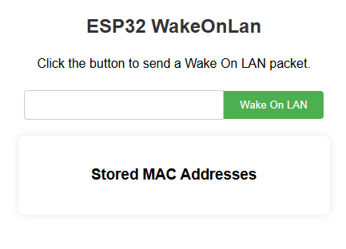

# WakeOnLan_ESP32

Tested Target:
- ESP32_S3_BLE
- ESP32_C6_THREAD

Tested Device:
- ESP32_S3_ZERO
- ESP32-C6-WROOM-1-N8

# Start

Before you start, you need to understand the basic operations of nanoframework.

For ESP32_S3_ZERO device, you need to flash ESP32_S3_BLE firmware. For other devices, please test it yourself.

```
nanoff --target ESP32_S3_BLE --serialport COM9 --update
```

Download the code, compile and deploy it to your hardware.

# Usage

Use the WeChat applet "Improv 蓝牙配网" or go to [improv-wifi website](https://www.improv-wifi.com/) to complete the network configuration and open the device page.


It is recommended to use the applet so that after the network configuration is successful, you can directly obtain the device IP.



# Other

<p align="center">
For more articles and related introductions, please follow my WeChat public account：桑榆肖物 <br/>

</p>